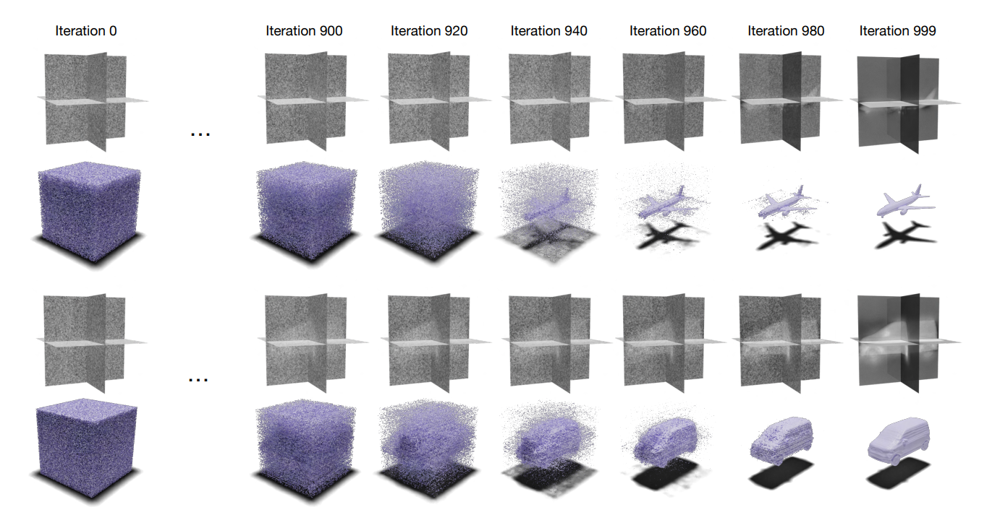
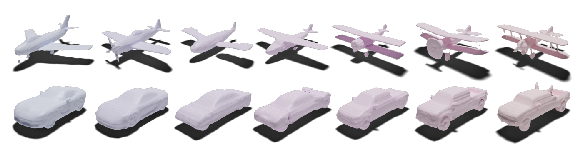
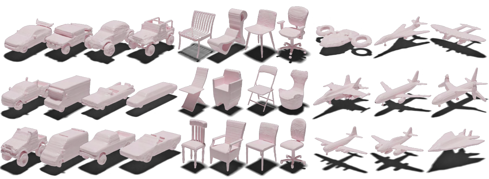

# NFD
This is the official codebase for the paper "3D Neural Field Generation using Triplane Diffusion."





**3D Neural Field Generation using Triplane Diffusion**<br>
J. Ryan Shue*, Eric Ryan Chan*, Ryan Po*, Zachary Ankner*, Jiajun Wu, and Gordon Wetzstein<br>*\* equal contribution*<br>
<br>https://jryanshue.com/nfd/<br>

Abstract: *Diffusion models have emerged as the state-of-the-art for image generation, among other tasks. Here, we present an efficient diffusion-based model for 3D-aware generation of neural fields. Our approach pre-processes training data, such as ShapeNet meshes, by converting them to continuous occupancy fields and factoring them into a set of axis-aligned triplane feature representations. Thus, our 3D training scenes are all represented by 2D feature planes, and we can directly train existing 2D diffusion models on these representations to generate 3D neural fields with high quality and diversity, outperforming alternative approaches to 3D-aware generation. Our approach requires essential modifications to existing triplane factorization pipelines to make the resulting features easy to learn for the diffusion model. We demonstrate state-of-the-art results on 3D generation on several object classes from ShapeNet.*

## Setup

We recommend Linux for compatibility, and an NVIDIA GPU with at least 6GB memory.
Environment setup (conda):
```
cd eg3d
conda env create -f environment.yml
conda activate eg3d
```

